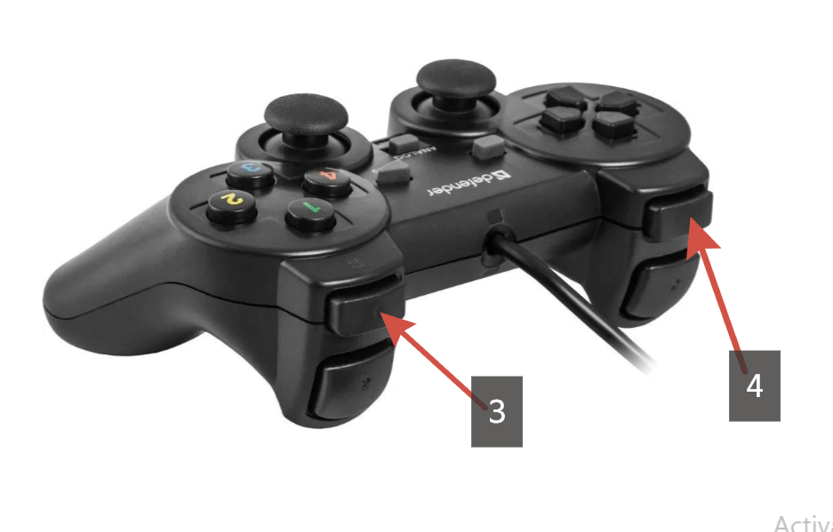
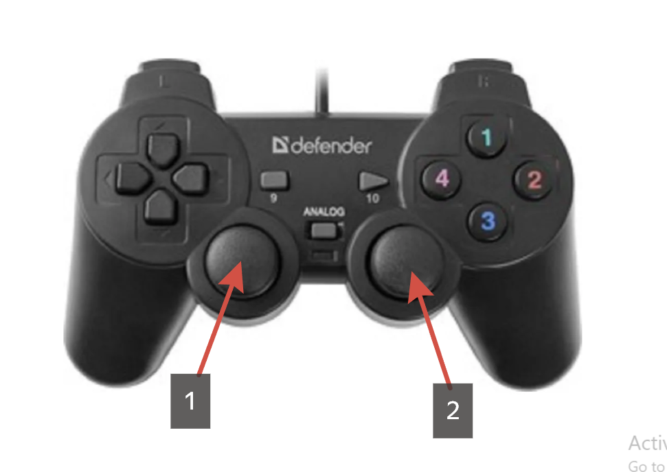

# TankCommander

A [libGDX](https://libgdx.com/) project generated with [gdx-liftoff](https://github.com/libgdx/gdx-liftoff).

This project was generated with a template including simple application launchers and an `ApplicationAdapter` extension that draws libGDX logo.

## Platforms

- `core`: Main module with the application logic shared by all platforms.
- `lwjgl3`: Primary desktop platform using LWJGL3; was called 'desktop' in older docs.

## Gradle

This project uses [Gradle](https://gradle.org/) to manage dependencies.
The Gradle wrapper was included, so you can run Gradle tasks using `gradlew.bat` or `./gradlew` commands.
Useful Gradle tasks and flags:

- `--continue`: when using this flag, errors will not stop the tasks from running.
- `--daemon`: thanks to this flag, Gradle daemon will be used to run chosen tasks.
- `--offline`: when using this flag, cached dependency archives will be used.
- `--refresh-dependencies`: this flag forces validation of all dependencies. Useful for snapshot versions.
- `build`: builds sources and archives of every project.
- `cleanEclipse`: removes Eclipse project data.
- `cleanIdea`: removes IntelliJ project data.
- `clean`: removes `build` folders, which store compiled classes and built archives.
- `eclipse`: generates Eclipse project data.
- `idea`: generates IntelliJ project data.
- `lwjgl3:jar`: builds application's runnable jar, which can be found at `lwjgl3/build/libs`.
- `lwjgl3:run`: starts the application.
- `test`: runs unit tests (if any).

Note that most tasks that are not specific to a single project can be run with `name:` prefix, where the `name` should be replaced with the ID of a specific project.
For example, `core:clean` removes `build` folder only from the `core` project.

# Tank

A [libGDX](https://libgdx.com/) project generated with [gdx-liftoff](https://github.com/libgdx/gdx-liftoff).

This project was generated with a template including simple application launchers and an `ApplicationAdapter` extension that draws libGDX logo.

## Platforms

- `core`: Main module with the application logic shared by all platforms.
- `lwjgl3`: Primary desktop platform using LWJGL3; was called 'desktop' in older docs.

## Gradle

This project uses [Gradle](https://gradle.org/) to manage dependencies.
The Gradle wrapper was included, so you can run Gradle tasks using `gradlew.bat` or `./gradlew` commands.
Useful Gradle tasks and flags:

- `--continue`: when using this flag, errors will not stop the tasks from running.
- `--daemon`: thanks to this flag, Gradle daemon will be used to run chosen tasks.
- `--offline`: when using this flag, cached dependency archives will be used.
- `--refresh-dependencies`: this flag forces validation of all dependencies. Useful for snapshot versions.
- `build`: builds sources and archives of every project.
- `cleanEclipse`: removes Eclipse project data.
- `cleanIdea`: removes IntelliJ project data.
- `clean`: removes `build` folders, which store compiled classes and built archives.
- `eclipse`: generates Eclipse project data.
- `idea`: generates IntelliJ project data.
- `lwjgl3:jar`: builds application's runnable jar, which can be found at `lwjgl3/build/libs`.
- `lwjgl3:run`: starts the application.
- `test`: runs unit tests (if any).

Note that most tasks that are not specific to a single project can be run with `name:` prefix, where the `name` should be replaced with the ID of a specific project.
For example, `core:clean` removes `build` folder only from the `core` project.

**English:**

Tank Commander is an intense top-down perspective action-strategy game where you take control of a heavily armed battle tank navigating through a dynamic 2D battlefield. The tank features a realistic dual-component mechanical system consisting of a robust tracked chassis that propels the vehicle across the terrain with responsive acceleration and turning mechanics, while a independently rotating turret mounted atop the chassis provides full 360-degree targeting capability separate from the tank's movement direction, allowing you to strafe around obstacles while keeping your weapons trained on enemies. The tank is armed with two distinct weapon systems integrated into the turret: a high-caliber cannon that delivers devastating explosive damage capable of obliterating reinforced obstacles and heavily armored enemy units with a single well-placed shot, and a rapid-fire machine gun that provides continuous suppressive fire perfect for dealing with fast-moving lightweight adversaries and clearing clusters of destructible environment objects. Using a standard Xbox controller, you command this war machine with intuitive dual-stick controls where the left stick maneuvers the tank's body across the battlefield while the right stick independently rotates the turret, creating a natural and immersive control scheme that separates movement from aiming, and you unleash your arsenal using the left and right shoulder buttons to fire the cannon and machine gun respectively. As you traverse the procedurally generated battlefield, you'll encounter increasingly challenging enemy tanks that employ sophisticated artificial intelligence behaviors including flanking maneuvers, coordinated attacks, and tactical retreats, along with a variety of destructible obstacles ranging from wooden barricades and explosive barrels to reinforced concrete walls that require strategic weapon selection to destroy efficiently. The game is designed with a modular architecture that allows for progressive complexity across development versions, starting with core movement and shooting mechanics in the initial prototype, then introducing enemy AI and collision systems in subsequent iterations, followed by advanced features like power-ups, environmental hazards, multiple enemy types with unique behaviors, and eventually a full campaign mode with boss encounters and unlockable upgrades that permanently enhance your tank's capabilities, ensuring a scalable development path that maintains clean code architecture while expanding gameplay depth.

**Spanish:**

Tank Commander es un intenso juego de acción y estrategia con vista cenital donde tomas el control de un tanque de guerra fuertemente armado que navega a través de un campo de batalla dinámico en 2D, presentando un sistema mecánico de doble componente que consiste en un robusto chasis con orugas que impulsa el vehículo a través del terreno con mecánicas de aceleración y giro responsivas, mientras que una torreta de rotación independiente montada sobre el chasis proporciona una capacidad de apuntado completa de 360 grados separada de la dirección de movimiento del tanque, permitiéndote desplazarte alrededor de obstáculos mientras mantienes tus armas fijas en los enemigos. El tanque está equipado con dos sistemas de armas distintos integrados en la torreta: un cañón de alto calibre que ofrece un devastador daño explosivo capaz de obliterar obstáculos reforzados y unidades enemigas fuertemente blindadas con un solo disparo bien colocado, y una ametralladora de fuego rápido que proporciona fuego de supresión continuo perfecto para enfrentar adversarios ligeros de movimiento rápido y limpiar grupos de objetos destructibles del entorno. Utilizando un control estándar de Xbox, comandas esta máquina de guerra con un sistema de control intuitivo de doble palanca donde la palanca izquierda maniobra el cuerpo del tanque a través del campo de batalla mientras que la palanca derecha rota la torreta de manera independiente, creando un esquema de control natural e inmersivo que separa el movimiento del apuntado, y desatas tu arsenal usando los botones superiores izquierdo y derecho para disparar el cañón y la ametralladora respectivamente. A medida que atraviesas el campo de batalla generado procesalmente, te enfrentarás a tanques enemigos cada vez más desafiantes que emplean comportamientos de inteligencia artificial sofisticados que incluyen maniobras de flanqueo, ataques coordinados y retiradas tácticas, junto con una variedad de obstáculos destructibles que van desde barricadas de madera y barriles explosivos hasta muros de concreto reforzado que requieren una selección estratégica de armas para destruirlos eficientemente. El juego está diseñado con una arquitectura modular que permite una complejidad progresiva a través de las versiones de desarrollo, comenzando con las mecánicas básicas de movimiento y disparo en el prototipo inicial, luego introduciendo inteligencia artificial enemiga y sistemas de colisión en iteraciones subsiguientes, seguido de características avanzadas como potenciadores, peligros ambientales, múltiples tipos de enemigos con comportamientos únicos, y eventualmente un modo campaña completo con encuentros contra jefes y mejoras desbloqueables que potencian permanentemente las capacidades de tu tanque, asegurando un camino de desarrollo escalable que mantiene una arquitectura de código limpia mientras expande la profundidad del juego.

## Diagrama de Clases (Mermaid)

```mermaid
classDiagram
    %% Patrón Command para inputs
    class InputCommand {
        <<interface>>
        +execute(entity: GameEntity)
    }
    
    class MoveCommand {
        -direction: Vector2
        +execute(entity: GameEntity)
    }
    
    class RotateTurretCommand {
        -angle: float
        +execute(entity: GameEntity)
    }
    
    class FireCannonCommand {
        +execute(entity: GameEntity)
    }
    
    class FireMachineGunCommand {
        +execute(entity: GameEntity)
    }
    
    class InputMapper {
        -commandMap: Map~Integer, InputCommand~
        +mapInput(inputCode: int, command: InputCommand)
        +handleInput(inputCode: int, entity: GameEntity)
    }
    
    InputCommand <|.. MoveCommand
    InputCommand <|.. RotateTurretCommand
    InputCommand <|.. FireCannonCommand
    InputCommand <|.. FireMachineGunCommand
    InputMapper --> InputCommand
    
    %% Patrón Component (ECS - Entity Component System)
    class Entity {
        +id: UUID
        +components: List~Component~
        +addComponent(component: Component)
        +getComponent~T~(class: Class~T~): T
        +removeComponent(class: Class~?~)
    }
    
    class Component {
        <<interface>>
        +update(delta: float)
    }
    
    class TransformComponent {
        +position: Vector2
        +rotation: float
        +scale: Vector2
    }
    
    class PhysicsComponent {
        +velocity: Vector2
        +maxSpeed: float
        +acceleration: float
        +applyForce(force: Vector2)
        +update(delta: float)
    }
    
    class RenderComponent {
        +textureRegion: TextureRegion
        +layer: int
        +render(camera: OrthographicCamera)
    }
    
    class HealthComponent {
        +currentHealth: float
        +maxHealth: float
        +isAlive: boolean
        +takeDamage(amount: float)
        +heal(amount: float)
    }
    
    class TankBodyComponent {
        +trackSpeed: float
        +turnSpeed: float
        +moveDirection: Vector2
        +updateMovement(delta: float)
    }
    
    class TurretComponent {
        +turretAngle: float
        +rotationSpeed: float
        +rotateTo(angle: float)
        +getWorldPosition(): Vector2
    }
    
    class WeaponComponent {
        +weapons: List~Weapon~
        +currentWeaponIndex: int
        +fireCurrent(): Projectile
        +switchWeapon(index: int)
    }
    
    Entity --> Component
    Component <|.. TransformComponent
    Component <|.. PhysicsComponent
    Component <|.. RenderComponent
    Component <|.. HealthComponent
    Component <|.. TankBodyComponent
    Component <|.. TurretComponent
    Component <|.. WeaponComponent
    
    %% Patrón Strategy para armas
    class Weapon {
        <<interface>>
        +fire(origin: Vector2, direction: Vector2): Projectile
        +getCooldown(): float
        +getAmmo(): int
        +reload()
    }
    
    class Cannon {
        +damage: float
        +blastRadius: float
        +fire(origin: Vector2, direction: Vector2): Projectile
    }
    
    class MachineGun {
        +damage: float
        +fireRate: float
        +fire(origin: Vector2, direction: Vector2): Projectile
    }
    
    class Projectile {
        +damage: float
        +velocity: Vector2
        +lifeTime: float
        +onHit(entity: Entity)
    }
    
    Weapon <|.. Cannon
    Weapon <|.. MachineGun
    WeaponComponent --> Weapon
    WeaponComponent --> Projectile
    
    %% Patrón State para estados del juego
    class GameState {
        <<interface>>
        +enter()
        +update(delta: float)
        +render()
        +exit()
    }
    
    class PlayingState {
        -world: GameWorld
        -player: Entity
        -enemies: List~Entity~
        +update(delta: float)
        +spawnEnemy()
    }
    
    class PauseState {
        +update(delta: float)
        +render()
    }
    
    class GameOverState {
        +score: int
        +render()
    }
    
    class StateMachine {
        -states: Map~String, GameState~
        -currentState: GameState
        +changeState(stateId: String)
        +update(delta: float)
    }
    
    GameState <|.. PlayingState
    GameState <|.. PauseState
    GameState <|.. GameOverState
    StateMachine --> GameState
    
    %% Patrón Observer para eventos
    class GameEvent {
        <<interface>>
    }
    
    class DamageEvent {
        +target: Entity
        +source: Entity
        +amount: float
    }
    
    class DeathEvent {
        +entity: Entity
    }
    
    class ScoreEvent {
        +points: int
    }
    
    class EventListener {
        <<interface>>
        +onEvent(event: GameEvent)
    }
    
    class EventManager {
        -listeners: Map~Class~? extends GameEvent~, List~EventListener~~
        +subscribe(eventType: Class, listener: EventListener)
        +unsubscribe(eventType: Class, listener: EventListener)
        +dispatch(event: GameEvent)
    }
    
    GameEvent <|.. DamageEvent
    GameEvent <|.. DeathEvent
    GameEvent <|.. ScoreEvent
    EventManager --> EventListener
    PlayingState --> EventManager
    
    %% Patrón Factory para creación de entidades
    class EntityFactory {
        +createPlayer(position: Vector2): Entity
        +createEnemy(type: EnemyType, position: Vector2): Entity
        +createObstacle(type: ObstacleType, position: Vector2): Entity
        +createProjectile(type: ProjectileType, position: Vector2, direction: Vector2): Entity
    }
    
    class EnemyType {
        <<enumeration>>
        BASIC
        FAST
        HEAVY
        BOSS
    }
    
    class ObstacleType {
        <<enumeration>>
        WALL
        BARREL
        TREE
        DESTRUCTIBLE_WALL
    }
    
    PlayingState --> EntityFactory
    
    %% Sistema principal del juego
    class GameWorld {
        -entities: List~Entity~
        -systems: List~GameSystem~
        -eventManager: EventManager
        +addEntity(entity: Entity)
        +removeEntity(entity: Entity)
        +update(delta: float)
    }
    
    class GameSystem {
        <<interface>>
        +update(delta: float, entities: List~Entity~)
    }
    
    class PhysicsSystem {
        +update(delta: float, entities: List~Entity~)
        +checkCollisions()
    }
    
    class RenderSystem {
        +update(delta: float, entities: List~Entity~)
        +render(camera: OrthographicCamera)
    }
    
    class AISystem {
        +update(delta: float, entities: List~Entity~)
    }
    
    GameWorld --> Entity
    GameWorld --> GameSystem
    GameSystem <|.. PhysicsSystem
    GameSystem <|.. RenderSystem
    GameSystem <|.. AISystem
    PlayingState --> GameWorld
    
    %% Controladores de entrada
    class XboxController {
        -controller: Controller
        -deadZone: float
        +getLeftStick(): Vector2
        +getRightStick(): Vector2
        +isButtonPressed(button: int): boolean
    }
    
    class GameController {
        -xboxController: XboxController
        -inputMapper: InputMapper
        -playerEntity: Entity
        +processInput(delta: float)
    }
    
    GameController --> XboxController
    GameController --> InputMapper
    GameController --> Entity
```

## Explicación del Diseño y Patrones Aplicados

### 1. **Entity Component System (ECS)**
- **Clases:** `Entity`, `Component`, `TransformComponent`, `PhysicsComponent`, etc.
- **Beneficio:** Permite una composición flexible. Puedes agregar nuevas características a las entidades sin modificar jerarquías de herencia complejas. Ideal para juegos con muchas entidades que comparten comportamientos.

### 2. **Command Pattern**
- **Clases:** `InputCommand`, `MoveCommand`, `RotateTurretCommand`, `FireCannonCommand`
- **Beneficio:** Desacopla la entrada del usuario de la lógica del juego. Facilita:
    - Reasignación de controles en tiempo real
    - Grabación de macros/replays
    - Soporte para diferentes dispositivos de entrada
    - Pruebas unitarias

### 3. **Strategy Pattern**
- **Clases:** `Weapon`, `Cannon`, `MachineGun`
- **Beneficio:** Permite cambiar el comportamiento de las armas dinámicamente. Puedes agregar nuevas armas (lanzamisiles, rayos láser) sin modificar la clase `WeaponComponent`.

### 4. **State Pattern**
- **Clases:** `GameState`, `PlayingState`, `PauseState`, `GameOverState`
- **Beneficio:** Gestiona los diferentes estados del juego de manera limpia. Cada estado tiene su propia lógica de actualización y renderizado. Escalable para añadir menús, cinemáticas, etc.

### 5. **Observer Pattern**
- **Clases:** `EventManager`, `EventListener`, `GameEvent`, `DamageEvent`
- **Beneficio:** Desacopla los sistemas que generan eventos de los que responden a ellos. Perfecto para:
    - Sistema de logros
    - UI que muestra puntuación
    - Efectos de sonido
    - Sistema de partículas

### 6. **Factory Pattern**
- **Clases:** `EntityFactory`
- **Beneficio:** Centraliza la creación de entidades complejas. Facilita:
    - Configuración desde archivos JSON/XML
    - Creación consistente de entidades
    - Soporte para diferentes tipos de enemigos/obstáculos

### 7. **System Pattern**
- **Clases:** `GameSystem`, `PhysicsSystem`, `RenderSystem`, `AISystem`
- **Beneficio:** Separa las preocupaciones por responsabilidad. Cada sistema maneja un aspecto específico del juego, facilitando:
    - Pruebas independientes
    - Optimización (ejecutar sistemas en paralelo)
    - Desactivar/activar sistemas en tiempo de ejecución

## Escalabilidad y Versiones

### **Versión 1.0 (Prototipo)**
- Implementar `Entity` y componentes básicos
- `InputMapper` con comandos básicos
- `PlayingState` simple sin enemigos
- `EntityFactory` para crear solo el tanque del jugador

### **Versión 2.0 (Mecánicas básicas)**
- Añadir `PhysicsSystem` con colisiones simples
- Implementar `WeaponComponent` con `Cannon`
- `AISystem` con enemigos básicos que persiguen
- Sistema de puntuación con `EventManager`

### **Versión 3.0 (Complejidad media)**
- `MachineGun` como segunda arma
- `TurretComponent` rotación independiente
- Obstáculos destructibles
- Sistema de salud con `HealthComponent`

### **Versión 4.0 (Características avanzadas)**
- Múltiples tipos de enemigos (`EnemyType`)
- Power-ups (crear nuevas armas con `Strategy`)
- Sistema de partículas (eventos de impacto)
- Guardado/carga de progreso

